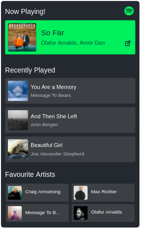

# Spotify Stats for Github Profile

<!-- [START badges] -->

  <!-- [CodeFactor grade] -->
<!--    -->
  <!-- [GitHub license] -->
  
  <!-- [PRs welcome] -->
  

<!-- [END badges] -->

<!-- [START description] -->

> [Spotify Stats for Github Pofile](https://github.com/narixius/github-profile-spotify-stats) generates a beautiful Spotify status (including current playing song, recently played songs, and favourite artist) for github profiles.

> Technically, it's a serverless function that generates a SVG image based on your <a href="https://www.spotify.com/us/">Spotify</a> state. It can be deployed on every <a href="https://en.wikipedia.org/wiki/Function_as_a_service">faas</a> providors (specially <a href="https://vercel.com">Vercel</a>). Also It is using <a href="https://ejs.co/">EJS</a> out of the box to inject data into SVG image.

<!-- [END description] -->

#### Demo

- [github.com/narixius](https://github.com/narixius)

## Table of contents

- [Requirements](#requirements)
  - [How to create a Spotify app?](#how-to-create-a-spotify-app)
- [Deploy on Vercel](#deploy-on-vercel)

## Requirements

1. Spotify App
2. Vercel account

Before deploying this app on vercel, you need to create a Spotify app in [Spotify developer dashboard](https://developer.spotify.com/dashboard/). Using this app, you can access users' information (actually your information).

### How to create a Spotify app?

1. Login to <a href="https://developer.spotify.com/dashboard/" target="_blank">Spotify developer dashboard</a>.
2. Click on <b>Create an app button</b> and chose a name and description for your app (e.g `name: github-profile`, `description: for github profile status`)
3. Store the `Client ID` and `Client Secret` in a safe place because we have to use them in the deployment process.

### Deploy on [Vercel](https://vercel.com)

Using this 
button, you can start the deployment on vercel.

On the deployment process, after setting a git repository,

On the `Configure Project` set these environment variables:

- `SPOTIFY_CLIENT_ID` : Use your Spotify app client id
- `SPOTIFY_CLIENT_SECRET`: Use your Spotify app client secret
- `SPOTIFY_REFRESH_TOKEN`: Use a random value here, it will change after deployment process

### After deployment

1. open the deployed app and go to `/init` endpoint
2. Complete information about how to set refresh token is mentioned on the `/init` endpoint. Follow the instructions to generate Refresh token.

After setting the refresh token, go to the root path `/` and see the result :)
